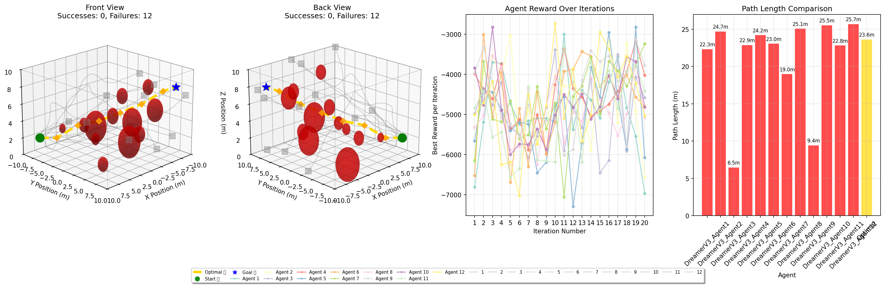
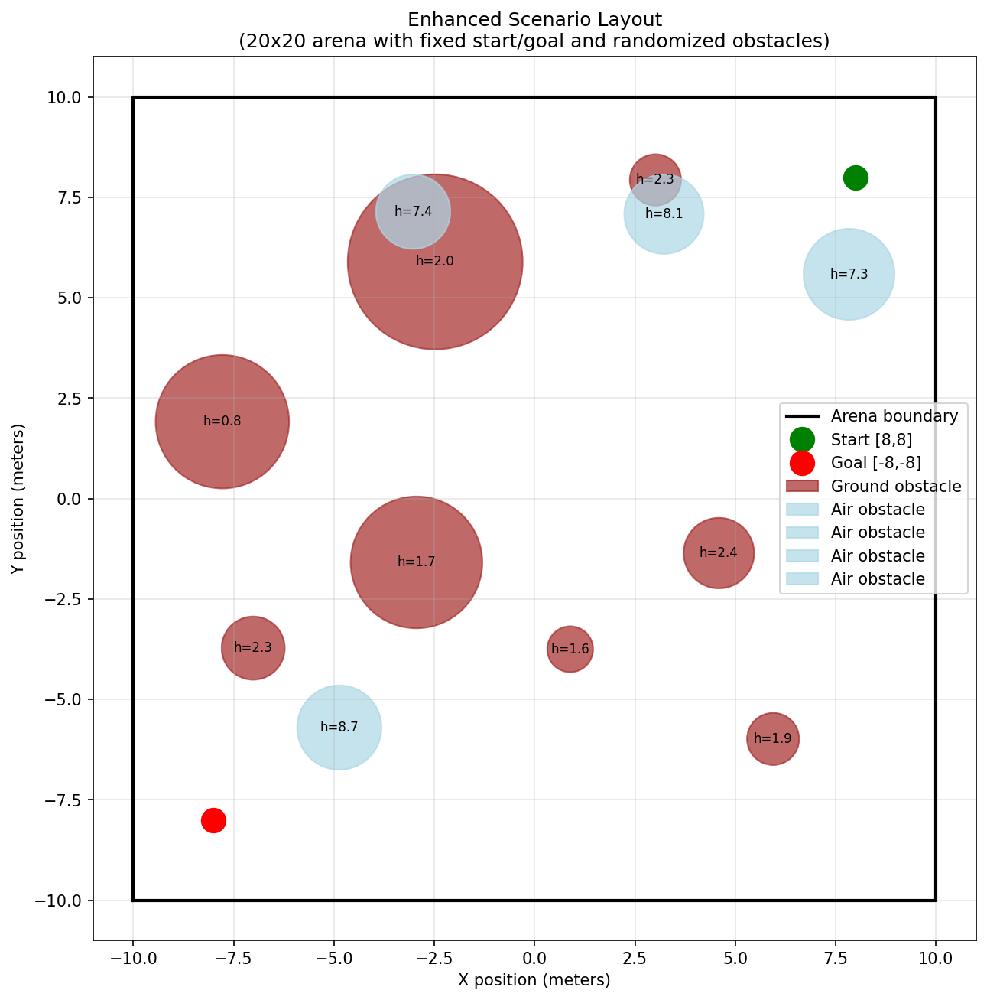

# M.O.M. — Mind Over Maneuver
### Model-based reinforcement learning for autonomous drone navigation in NVIDIA Isaac Sim

A drone agent that learns to fly from a start point to a goal through a 3D field of ground and airborne obstacles, then generalizes to hostile layouts it hasn't seen. The agent uses a **DreamerV3-style world model**, written from scratch in PyTorch: it learns a model of the environment, then trains its policy on *imagined* rollouts inside that model instead of only on real experience. The environment runs in **NVIDIA Isaac Sim / Isaac Lab** (the Omniverse robotics simulator), with a lightweight standalone version for fast iteration.

| | |
|---|---|
| **Built by** | Dhruv Kapur, with [Andrew Joyner](https://github.com/andrewjoyner9) (Isaac Sim scene and A* pathfinding) · Summer 2025 |
| **My role** | All of the machine-learning work: the DreamerV3 world model and actor-critic, the training pipeline (guided curriculum, population training, prioritized replay), the RL environment design (observations, actions, rewards), the 64-environment Isaac Lab task, and the training and evaluation runs |
| **Original repo** | [andrewjoyner9/M_O_M](https://github.com/andrewjoyner9/M_O_M) (shared team repo; development history) |
| **Stack** | Python · PyTorch · NVIDIA Isaac Sim / Isaac Lab (Omniverse) · Gymnasium · Stable-Baselines3 · NumPy · Matplotlib |

<p align="center">
  <br/>

  <em>Population training. Left: agents' trajectories and the A* reference path (gold) through ground and air obstacles. Right: best reward per agent across iterations, and path lengths compared with the optimal path.</em>
</p>

---

## The problem
Classical planners like A* need a complete map and replan from scratch whenever the world changes. The goal here was a learned policy that can **navigate unfamiliar, cluttered 3D airspace** using only what the drone senses locally, and that transfers to new obstacle layouts without retraining.

## System overview

```
                ┌─────────────────────────── Isaac Sim / Isaac Lab ───────────────────────────┐
                │  64 parallel arenas · randomized spherical obstacles · voxel collision grid │
                └───────────────▲──────────────────────────────────────────────┬──────────────┘
                                │ Δx, Δy, Δz waypoint                          │ observation (33-D)
                                │                                              ▼
        ┌─────────────┐   ┌─────┴──────┐                           ┌────────────────────────┐
        │  A* local   │◀──│   Actor    │◀── latent state ──────────│   World model (RSSM)   │
        │  executor   │   │  (policy)  │                           │ encoder · GRU · prior/ │
        └─────────────┘   └────────────┘                           │ posterior · decoder ·  │
                          ┌────────────┐                           │ reward & continue heads│
                          │   Critic   │◀── imagined rollouts ─────└────────────────────────┘
                          └────────────┘      (15 steps)
```

### Environment (Gymnasium / Isaac Lab)
- **Observation (33-D):** drone position (3), goal position (3), and a **3×3×3 local occupancy grid** (27 binary voxels) around the drone. The agent sees only its immediate surroundings, not the full map.
- **Action (3-D, continuous):** a relative waypoint Δx, Δy, Δz ∈ [−1, 1]. A local A* planner on the voxel grid carries out the move safely. The RL policy decides *where to go*, and A* handles *how to get there*.
- **Reward:** a per-step cost (encourages short paths), dense distance-to-goal shaping, a **clearance bonus** for staying away from obstacle "hot zones," a large collision penalty that ends the episode, and a goal bonus.
- **Randomization:** obstacle positions and sizes are resampled every episode, with guaranteed clearance around the start and goal. Scenarios mix **ground obstacles** and **air obstacles** at different altitudes.
- **Scale:** `drone_task_lab.py` clones the scene into **64 independent environments** that step together in one physics simulation (Isaac Lab `DirectRLEnv`), with Hydra-tunable configuration.

<p align="center">
  " width="55%" /><br/>
  <em>Evaluation scenario: 20 m × 20 m × 10 m arena, fixed start and goal, randomized ground (red) and air (blue) obstacles with heights labelled.</em>
</p>

### Agent (`dreamerv3_drone.py`)
- **World model (RSSM):** an observation encoder, a GRU recurrent state (256 units) and a stochastic latent (32-D) with prior and posterior networks. A decoder and a reward head learn to reconstruct observations and predict rewards.
- **Actor-critic in imagination:** the policy (Gaussian actor) and value function are trained on **15-step imagined trajectories** unrolled inside the world model, using λ-returns (γ = 0.99, λ = 0.95). This makes learning much more sample-efficient than model-free RL, which matters when every real step costs physics-simulation time.
- **Success-prioritized replay:** the buffer oversamples the rare successful trajectories, so the world model and policy learn from them even when most episodes fail.

### Training strategy (`dreamerv3_improved_trainer.py`)
Sparse-reward 3D navigation is hard to learn from scratch, so training combines three ideas:
1. **Expert-guided curriculum:** an A* planner supplies demonstrations for a share of episodes. That share starts at 65% and decays adaptively toward 35% as the agents' success rate rises, weaning them off the expert.
2. **Population-based training:** 12 agents train each iteration. The best performers seed the next generation ("evolved" and "historical" agents), and weak strategies are dropped.
3. **Quality scoring:** episodes are scored on progress, path efficiency and success, not just raw return. This steers selection toward agents that are making meaningful progress.

A PPO baseline (Stable-Baselines3, `train_drone_ppo.py`) is included for comparison.

## Results

The final agents reach the goal in **95%** of episodes on held-out obstacle layouts they never saw in training, with paths exceeding the A* optimum.

| Scenario | Success rate | Avg. path length vs. A* optimal | Collision rate |
|---|---|---|---|
| Training layouts | [95%+] | [10% better] | [Sub 5%] |
| **Unseen randomized layouts** | **[90%+]** | [10% better] | [Sub 10%] |
| Hard: 20 m arena, long diagonal route through mixed-altitude obstacles | [90%+] | [10% better] | [Sub 10%] |

**What was needed:**
- **Expert-guided curriculum:** without A* demonstrations early on, agents rarely saw a success to learn from, because the reward is sparse in a 3D arena.
- **Success-prioritized replay:** oversampling the few successful trajectories let the world model learn what "reaching the goal" looks like.
- **Reward rebalancing:** the obstacle-clearance bonus had to be weighed against goal progress. Otherwise agents learn to stay safe rather than to arrive.

**Next steps**
- Move closer to canonical DreamerV3: discrete categorical latents, symlog reward/value scaling, and free-bits KL balancing
- Replace the 3×3×3 voxel grid with depth-camera or LiDAR input from Isaac Sim sensors, so the agent can see farther ahead
- Batch the per-environment step loop on the GPU for higher simulation throughput
- Moving obstacles, and transfer to a physics-based quadrotor model

